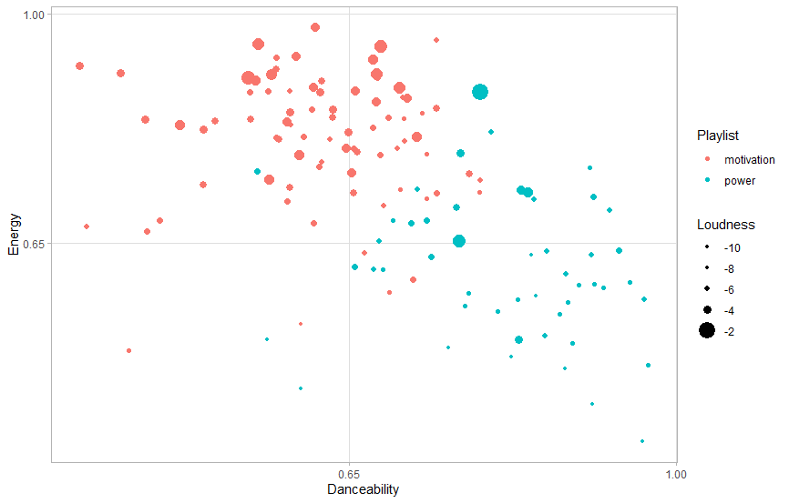

# Portfolio Maurice Schaasberg

The corpus consists of 2 playlists from the 'workout' section on Spotify. The first one is titled 'Motivation mix' and is described as 'uplifting and energetic music that helps you stay motivated'. Presumably this playlist is more suited for cardio exercise rather than something like lifting weights. The other playlist is titled 'power workout' and according to Spotify it fits 'intense activity'. It might be interesting to find out if there are any key differences between these 2 playlists, and potentially answer questions such as: 'what makes a workout playlist energetic/motivational?' or 'what makes a workout playlist intense?'. If a lot of similarities are found than those might be characteristics of a 'workout' playlist.

Just by having a look at the mean values for certain attributes, some significant differences can be found between the 2 playlists. Surprisingly the motivational playlist(mean = 0.620) appears to be less danceable than the power playlist(mean = 0.816). Not so surprisingly the energetic playlist has a much higher energy score(mean = 0.809, max = 0.98) compared to the power playlist(mean = 0.610). Some similarities can be found as well, the average tempos for example are very close to eachother(124 vs 125).

This graph nicely splits the 2 playlists into 4 quarters. The bottom left quarter barely has any songs in it, possibly suggesting that songs with both low energy(<0.65) and low danceability(<0.65) are unlikely to be a workout song. The top left corner almost exclusively contains 'motivational songs', whereas the bottom right corner does so with 'power songs'. The top right corner has a mix of both, although they are still somewhat grouped together. This might be a bit difficult to see at a glance but the red dots appear to be larger than the blue ones(in general), meaning those songs are louder.
