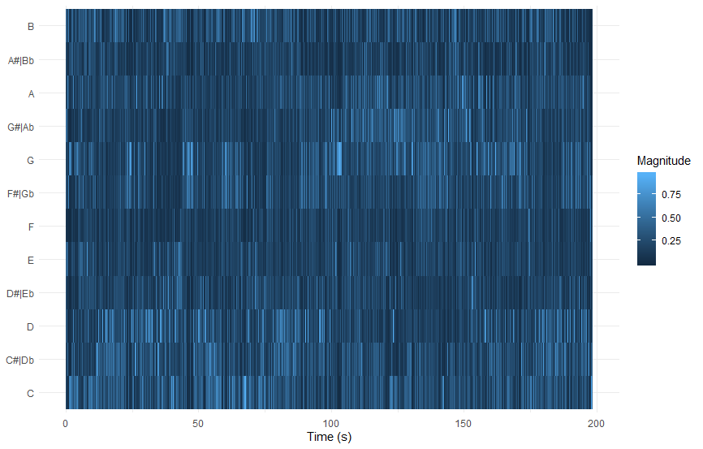

```{r setup}
# In order to use these packages, we need to install flexdashboard, plotly, and Cairo.
library(tidyverse)
library(plotly)
library(spotifyr)
source('spotify.R')
```
### Tempogram of an outlier {data-commentary-width=600}


***

Based on this tempogram, my hypothesis on the last slide doesn't seem to be true. This is the tempogram for the song "Where have you gone", one of the 15 songs mentioned previously. In the sd/mean bpm plot it showed that it had a standard deviation of about 48. The high standard deviation isn't caused by a slow intro/outro like I thought. Instead it appears that there is a sound with a bpm of about 95 that plays in the middle and last part of the song. This sound is most likely what made the standard deviation so high.

### Corpus {data-commentary-width=800}

The corpus consists of 2 playlists from the 'workout' section on Spotify. The first one is titled 'Motivation mix'(80 songs) and is described as 'uplifting and energetic music that helps you stay motivated'. Presumably this playlist is more suited for cardio exercise rather than something like lifting weights. The other playlist is titled 'power workout'(50 songs) and according to Spotify it fits 'intense activity'. It might be interesting to find out if there are any key differences between these 2 playlists, and potentially answer questions such as: 'what makes a workout playlist energetic/motivational?' or 'what makes a workout playlist intense?'. If a lot of similarities are found than those might be characteristics of a 'workout' playlist.

***

Just by having a look at the mean values for certain attributes, some significant differences can be found between the 2 playlists. Surprisingly the motivational playlist(mean = 0.620) appears to be less danceable than the power playlist(mean = 0.816). Not so surprisingly the energetic playlist has a much higher energy score(mean = 0.809, max = 0.98) compared to the power playlist(mean = 0.610). Some similarities can be found as well, the average tempos for example are very close to eachother(124 vs 125).


### The 4 quarters {data-commentary-width=400}

```{r}
power <- get_playlist_audio_features('spotify', '37i9dQZF1DWUVpAXiEPK8P')
motivation <- get_playlist_audio_features('spotify', '37i9dQZF1DXdxcBWuJkbcy')
combined <- power %>% mutate(playlist = "power") %>% bind_rows(motivation %>% mutate(playlist = "motivation"))
combined <- combined %>% rename(song = track.name)

plot1 <- ggplot(combined, aes(x = danceability, y = energy, color = playlist, size = loudness, label = song)) +
         geom_point() + scale_size_continuous(trans = "exp") +
         labs(x = "Danceability", y = "Energy", color="", size ="") +
         scale_x_continuous(limits = c(0.3, 1), breaks = c(0.3, 0.65, 1),minor_breaks=NULL) +
         scale_y_continuous(limits = c(0.3, 1), breaks = c(0.3, 0.65, 1),minor_breaks=NULL)


ggplotly(plot1) %>%
  layout(legend = list(x = 100, y = 0.8))
```

***

This graph nicely splits the 2 playlists into 4 quarters. The bottom left quarter barely has any songs in it, possibly suggesting that songs with both low energy(<0.65) and low danceability(<0.65) are unlikely to be a workout song. The top left corner almost exclusively contains 'motivational songs', whereas the bottom right corner does so with 'power songs'. The top right corner has a mix of both, although they are still somewhat grouped together. 

The size off the dots represent their loudness, with size increasing as they get louder. It might be a bit difficult to see at a glance, but the red dots appear to be larger than the blue ones overall. From this we can gather that those songs(Motivational) are slightly louder than those from the other playlist. One obvious exception is the big blue dot in the top right of the graph. This song is the loudest in the entire corpus, despite being in the quieter playlist. We'll have a look at this outlier on the next page.

### The big blue outlier {data-commentary-width=600}



***

Here we have the chromagram of the outlier mentioned on the previous page. This song seemed very atypical for the playlist it came from, so I decided to have a more detailed look at it. The chroma features however are very erratic. The pitch is all over the place, with the F key being the only one that isn't used as much. This just further confirms that this song is unusual, and an outlier.

The song is called "Camelot" by "NLE Choppa". After listening to the song I found out why the chromagram looks like this. The song has a bass kick that you would expect in a hip hop song, but along side this bass there's also a high pitch piano playing. These 2 are playing at the same time almost throughout the entire song. The bass is causing energy at the lower tones and the piano at the higher tones.

### A look at the song structures {data-commentary-width=600}


***

To get an idea of how songs are structured within each playlist, I decided to have a look at some self-similarity matrices. The songs that were chosen are both very central points on the energy-danceability plot. They each have energy and danceability values that are very close to the means of their respective playlist.

The 2 matrices on the top were made using the song "hot" from the "power" playlist. The pitch and timbre appear to have a very similar structure, suggesting that whenever the pitch changes whenever the timbre changes and vice versa. The overall structure is a fairly standard checkerboard. This song likely has a chorus that is played 3 times, which is represented by the boxes. In between each chorus there is a verse which can be seen by the horizontal/vertical lines.

From the "motivational" playlist I chose the song " Perfect Crime'. This one shows very different characteristics as the previous one. This time, the timbre and pitch don't change at the same time. The pitch also shows very drastic and frequent variation, there are a lot of straight lines and their intensity is high. In contrast, the timbre has a much clearer structure and the changes aren't anywhere near as intense or frequent.

### A consistent tempo {data-commentary-width=600}


***

What we see in the plot is quite peculiar. It appears that the motivation mix has an extremely consist tempo, with almost all the songs having a bpm of around 125. The power mix shows the complete opposite. The songs of that playlist are all over the place, with bpm's ranging from 75 all the way up to 150. This would suggest that the motivation mix has a far more consistent sound. When all the songs have roughly the same tempo songs will sound somewhat similar. If you transition from a 75 bpm track to a 150 bpm one, you'll notice a very big difference. The standard deviations are all fairly low which means that the songs themselves have a consistent tempo. 

However things aren't as they seem. What can't be seen in this plot, but can be seen when you change the limit of the y axis, is a cluster of about 15 songs from the motivational mix. The mean tempo is again around 125 for this cluster, but the standard deviation for this cluster is about 40. What I suspect is going on here, is that this is caused by tracks that have an intro and possibly an outro. I did notice that the motivation mix has some tracks where the first minute or so, is just building up to a drop. The actual beat takes some time to kick in so the bpm starts low and shoots up later in the song. This would cause the standard deviation to be really high like it is for these 15 tracks.