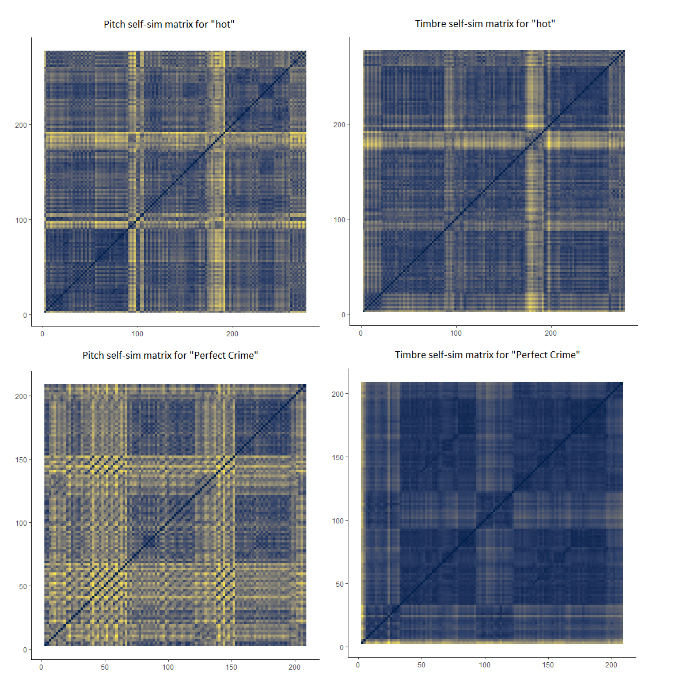
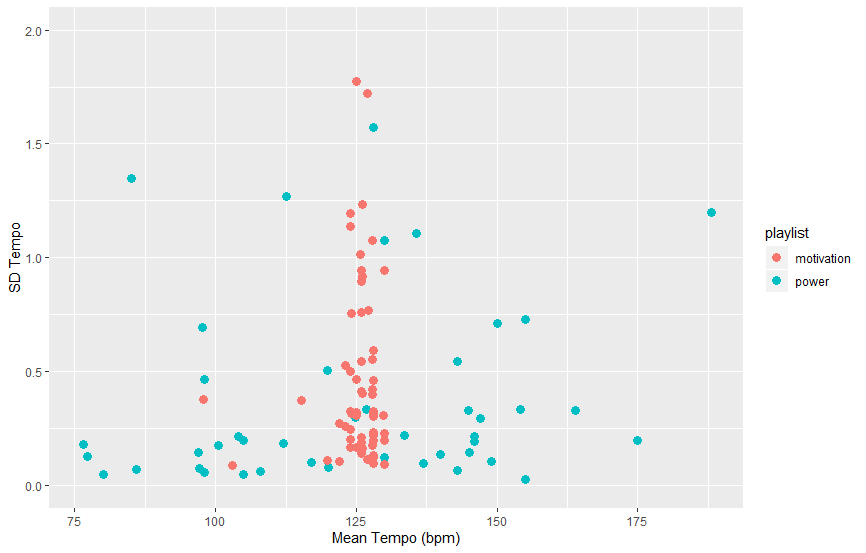
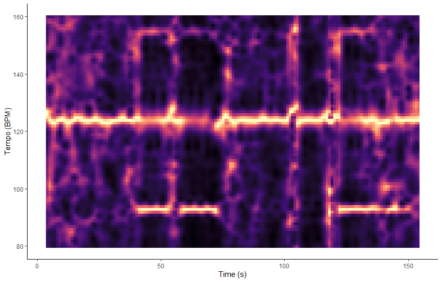
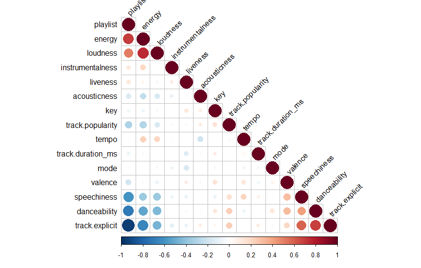
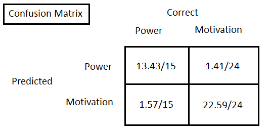

```{r setup}
# In order to use these packages, we need to install flexdashboard, plotly, and Cairo.
library(tidyverse)
library(plotly)
library(spotifyr)
source('spotify.R')
```
### Corpus {data-commentary-width=800}

The corpus consists of 2 playlists from the 'workout' section on Spotify. The first one is titled 'Motivation mix'(80 songs) and is described as 'uplifting and energetic music that helps you stay motivated'. Presumably this playlist is more suited for cardio exercise rather than something like lifting weights. The other playlist is titled 'power workout'(50 songs) and according to Spotify it fits 'intense activity'. It might be interesting to find out if there are any key differences between these 2 playlists, and potentially answer questions such as: 'what makes a workout playlist energetic/motivational?' or 'what makes a workout playlist intense?'. If a lot of similarities are found than those might be characteristics of a 'workout' playlist.

IMPORTANT NOTE: Both playlists have changed since the beginning, I did not anticipate this and made no back ups of the old versions. The static plots could look different if they were updated. The interactive plot is up to date but the analysis was based on an older version so might be inaccurate. Individual songs that were mentioned/analyzed may no longer be a part of the playlist.

***

Just by having a look at the mean values for certain attributes, some significant differences can be found between the 2 playlists. Surprisingly the motivational playlist(mean = 0.620) appears to be less danceable than the power playlist(mean = 0.816). Not so surprisingly the energetic playlist has a much higher energy score(mean = 0.809, max = 0.98) compared to the power playlist(mean = 0.610). Some similarities can be found as well, the average tempos for example are very close to eachother(124 vs 125).


### The 4 quarters {data-commentary-width=400}

```{r}
power <- get_playlist_audio_features('spotify', '37i9dQZF1DWUVpAXiEPK8P')
motivation <- get_playlist_audio_features('spotify', '37i9dQZF1DXdxcBWuJkbcy')
combined <- power %>% mutate(playlist = "power") %>% bind_rows(motivation %>% mutate(playlist = "motivation"))
combined <- combined %>% rename(song = track.name)

plot1 <- ggplot(combined, aes(x = danceability, y = energy, color = playlist, size = loudness, label = song)) +
         geom_point() + scale_size_continuous(trans = "exp") +
         labs(x = "Danceability", y = "Energy", color="", size ="") +
         scale_x_continuous(limits = c(0.3, 1), breaks = c(0.3, 0.65, 1),minor_breaks=NULL) +
         scale_y_continuous(limits = c(0.3, 1), breaks = c(0.3, 0.65, 1),minor_breaks=NULL)


ggplotly(plot1) %>%
  layout(legend = list(x = 100, y = 0.8))
```

***

This graph nicely splits the 2 playlists into 4 quarters. The bottom left quarter barely has any songs in it, possibly suggesting that songs with both low energy(<0.65) and low danceability(<0.65) are unlikely to be a workout song. The top left corner almost exclusively contains 'motivational songs', whereas the bottom right corner does so with 'power songs'. The top right corner has a mix of both, although they are still somewhat grouped together. 

The size off the dots represents their loudness, with size increasing as they get louder. It might be a bit difficult to see at a glance, but the red dots appear to be larger than the blue ones overall. From this we can gather that those songs(Motivational) are slightly louder than those from the other playlist.

### A look at the song structures {data-commentary-width=600}



***

To get an idea of how songs are structured within each playlist, I decided to have a look at some self-similarity matrices. The songs that were chosen are both very central points on the energy-danceability plot. They each have energy and danceability values that are very close to the means of their respective playlist.

The 2 matrices on the top were made using the song "hot" from the "power" playlist. The pitch and timbre appear to have a very similar structure, suggesting that whenever the pitch changes whenever the timbre changes and vice versa. The overall structure is a fairly standard checkerboard. This song likely has a chorus that is played 3 times, which is represented by the boxes. In between each chorus there is a verse which can be seen by the horizontal/vertical lines.

From the "motivational" playlist I chose the song " Perfect Crime'. This one shows very different characteristics as the previous one. This time, the timbre and pitch don't change at the same time. The pitch also shows very drastic and frequent variation, there are a lot of straight lines and their intensity is high. In contrast, the timbre has a much clearer structure and the changes aren't anywhere near as intense or frequent.

### A consistent tempo {data-commentary-width=600}



***

What we see in the plot is quite peculiar. It appears that the motivation mix has an extremely consist tempo, with almost all the songs having a bpm of around 125. The power mix shows the complete opposite. The songs of that playlist are all over the place, with bpm's ranging from 75 all the way up to 150. This would suggest that the motivation mix has a far more consistent sound. When all the songs have roughly the same tempo songs will sound somewhat similar. If you transition from a 75 bpm track to a 150 bpm one, you'll notice a very big difference. The standard deviations are all fairly low which means that the songs themselves have a consistent tempo. 

However things aren't as they seem. What can't be seen in this plot, but can be seen when you change the limit of the y axis, is a cluster of about 15 songs from the motivational mix. The mean tempo is again around 125 for this cluster, but the standard deviation for this cluster is about 40. What I suspect is going on here, is that this is caused by tracks that have an intro and possibly an outro. I did notice that the motivation mix has some tracks where the first minute or so, is just building up to a drop. The actual beat takes some time to kick in so the bpm starts low and shoots up later in the song. This would cause the standard deviation to be really high like it is for these 15 tracks.

### Tempogram of an outlier {data-commentary-width=600}



***

Based on this tempogram, my hypothesis on the last slide doesn't seem to be true. This is the tempogram for the song "Where have you gone", one of the 15 songs mentioned previously. In the sd/mean bpm plot it showed that it had a standard deviation of about 48. The high standard deviation isn't caused by a slow intro/outro like I thought. Instead it appears that there is a sound with a bpm of about 95 that plays in the middle and last part of the song. This sound is most likely what made the standard deviation so high.

### Correlation Matrix {data-commentary-width=600}



***

I plan to train a binary classifier using logistic regression. I want to predict what playlist a song belongs to based on some features. To decide what features I want to use for my model, I made a correlation matrix. I made a new column where the playlist is represented by either a 0 or a 1. 0 is the intense playlist, 1 the motivational playlist. This means that the features that have a positive correlation with the playlist column, tend to have a higher value for songs in the motivational playlist. Conversely, features that have a negative correlation with the playlist will have higher values for songs from the intense playlist. 

I was very worried when I saw the large blue dot in the bottom left which represents a correlation of -0.95. This seemed way too high so I looked at the data. The feature is "track.explicit" which is a binary value that states whether a track contains strong/offensive language. To my surprise the intense playlist had 49/50 tracks that were explicit, whilst the motivational playlist only had 2/80. This is a problem since using this feature would make training any classifier far too easy. You could simply ask whether a track is explicit and get an accuracy of 127/130(97.6%). Because of that, I decided not to use track.explicit.

The features that I used instead are: energy, loudness, speechiness and danceability. We've already looked at 2 of these(energy & danceability) and found that they can split the data quite nicely. Speechiness and loudness were added because they show strong correlations, both with a different playlist. This way we end up with 2 features that strongly correlate with the motivational playlist and 2 that strongly correlate with the intense playlist.

### Classifier results {data-commentary-width=600}



***

To evaluate the models performance I first split the data into a training and test set. I used the standard 70/30 split but also made sure that the intense:motivational ratio stayed the same(50:80). The training set contains 35 intense songs and 56 motivational songs. The test set consists of the remaining 15 intense and 24 motivational tracks.

Next I fitted a logistic regression model on the training set, using the features mentioned previously. The trained model was then used to make predictions on the test set.

Due to working with such a small dataset, this process was repeated 1000 times. Each time a new training/test split was generated and a new model was trained/evaluated. This makes the results far more reliable since they are no longer dependant on how the data is split up.

The average accuracy over 1000 iterations was 92.4%. Out of the 15 power songs 13.43(on average) were correctly predicted to be a power song, and 1.57 were incorrectly predicted to be a motivational song. Out of the 24 motivational songs 22.59 were correctly predicted to be a motivational song, and 1.41 were incorrectly predicted to be a power song.

### Conclusion {data-commentary-width=600}
2 workout playlists made by Spotify were analyzed and compared to see if Spotifys track selection was consistent, and what the defining characteristics of each playlist are.

The first plot showed that the motivational playlist tends have higher energy and loudness, whilst the intense playlist tends to be more danceable and quieter.

A central song was chosen for each playlist and their structures were compared using self similarity matrices for pitch and timbre. The intense song had a typical structure, pitch and timbre both changed at the same time. The motivational song had very drastic pitch changes, a less typical structure, and pitch and timbre did not show the same pattern. 

The tempo's of each playlist were analyzed. It was found that motivational songs all have roughly the same tempo, whereas the intense songs had no consistency whatsoever. 

Finally a binary classifier was trained that could predict what playlist a song belonged to. It had an accuracy of about 92% which tells us Spotify must have been consistent with their song choices for both playlists. If they hadn't been consistent such a high accuracy score wouldn't be possible. 